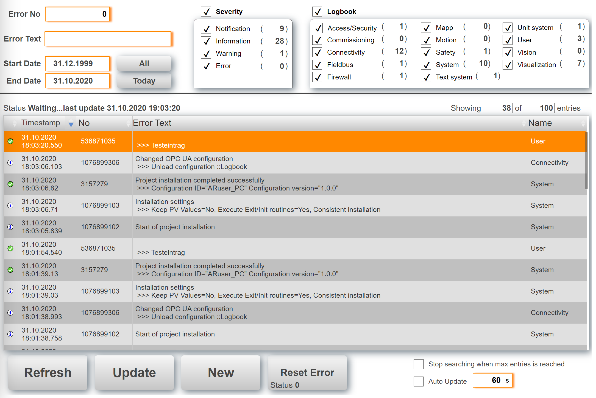

## Table of Contents
* [Introduction](#Introduction)
* [Requirements](#Requirements)
* [Revision History](#Revision-History)

## Introduction
This is a sample project to read the PLC logbook with mappView. It uses the B&R library ArEvent to access the logbook information. This implementation has the following advantage over embedding the SDM interface into a web widget control.
* mappView look and feel
* Only the logbook can be integrated without the other SDM features
* All facility can be read in one step
* Mutliple filters can be applied to reduce the number of hits

Also see [**How to import the user management into an existing project.**](Logical/mappLogbook/HowToImport.pdf) Download the latest release from [**here.**](https://github.com/br-automation-com/mappView-Logbook/releases/latest) Detailed information are available in the [**Wiki**](https://github.com/br-automation-com/mappView-Logbook/wiki).

## Requirements
* Automation Studio 4.7
* mappView 5.11.3
* Automation Runtime C4.72

Recommended task class is #8 with a 10ms cycle time.

## Revision History

#### Version 0.1
- First public release
